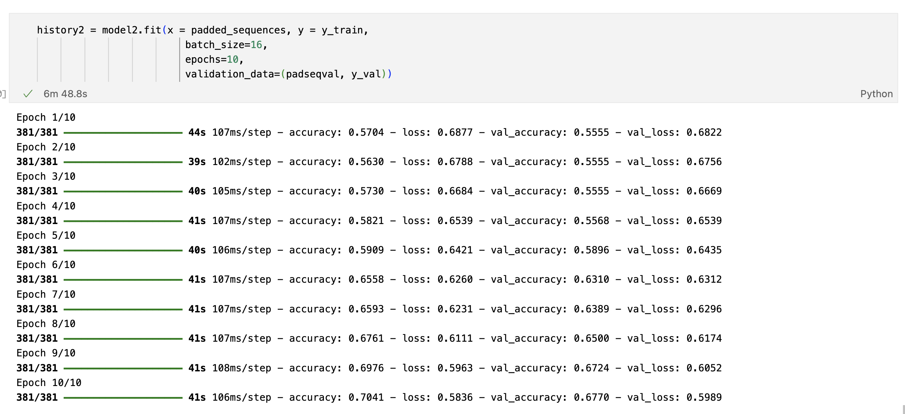
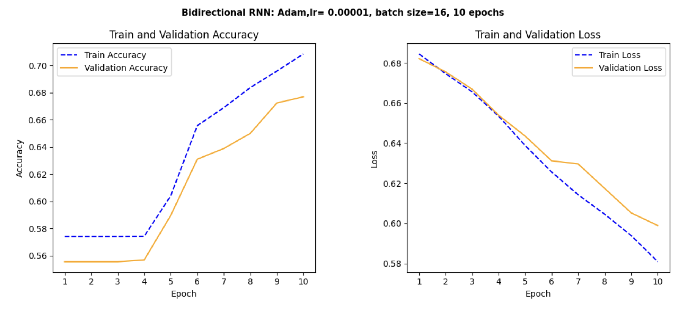
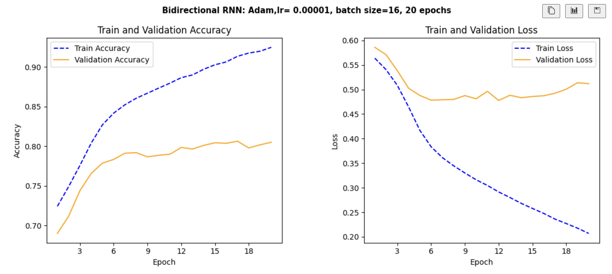
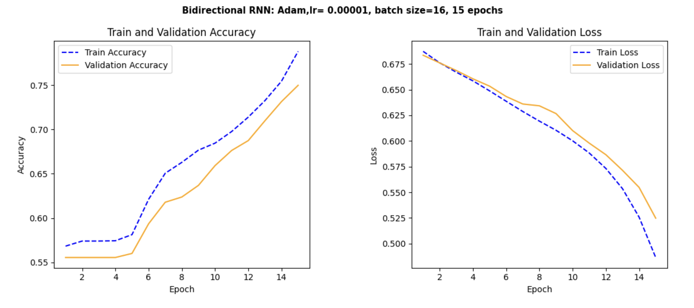
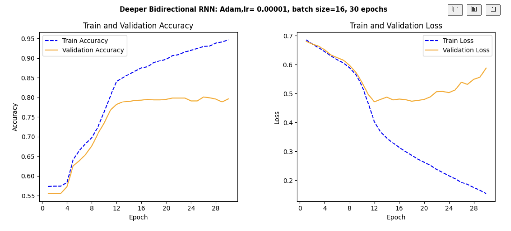
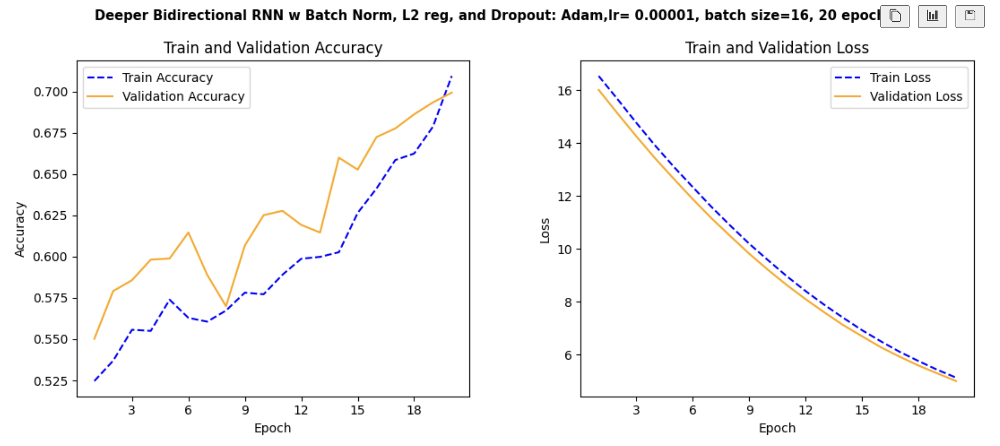

# TwitterDisasters
Given a tweet, predict if it concerns a disaster or not.
## Kaggle competition: Natural Language Processing with Disaster Tweets
### Project Description
Given X is an important channel for communicating times of emergency, the goal of this project is to build a machine learning model that predicts which tweets are about real disasters and which aren't.  The models will be evaluated on F1 between predicted and expected answers.

### Data Description
Below is a breakdown of the dataset provided.  The project desciption on Kaggle states that 10000 tweets are provided.  When looking at the breakdown below, it appears the training set contains 7613 tweets, while the test set has 3263 tweets.  Examples of tweets have been printed below, to give an idea of the format and content of each data point.  The dataset includes the transcript of the tweet, along with a coresponding keyword and location included for some values in each set.  Target is 1 if a real disaster, 0 in not a disaster.

A. Howard, devrishi, P. Culliton, and Y. Guo, “Natural language pro-
cessing with disaster tweets,” https://kaggle.com/competitions/nlp-getti
ng-started, 2019, kaggle.

### Results and Analysis
Below is a summary of hyper-parameter tuning for each model and the resulting performance of each model at it's best.
- Model 1:  distil_bert_text_classifier from keras library
    - pretrained on wikipedia corpus
    - I didn't tune this model as the 66,955,010 were pretrained and frozen.
- Model 2: Bidirectional RNN with LSTM
    - 2 Bidirectional and 2 Dense Layers
    - 2,357,377 total parameters
    - binary crossentropy loss function, Adam optimizer with learning_rate=0.00001, beta_1=0.9, beta_2=0.99
    - batch size 16, 15 epochs
    - **Tuning:**  Started with 10 epochs but didn't converge.\
 

    - Also, experimented with batch size, but larger batch sizes didn't mesh well with small validation set.
- Model 3: Deeper Bidirectional RNN with LSTM
    - 3 Bidirectional and 4 Dense Layers
    - 2,464,513 total parameters
    - binary crossentropy loss function, Adam optimizer with learning_rate=0.00001, beta_1=0.9, beta_2=0.99
    - batch size 16, 15 epochs
    - **Tuning:** Started with 30 epochs but overfit.\
    
- Model 4: Deeper Bidirectional RNN with LSTM with regularization
    - 3 Bidirectional with Batch Normalization before each layer and 4 Dense layers with Dropout(0.5) between each
    - 2,571,009 parameters
    - binary crossentropy loss function, Adam optimizer with learning_rate=0.00001, beta_1=0.9, beta_2=0.99
    - batch size 16, 40 epochs
    - **Tuning:** Started with 20 epochs but didn't converge.\
    
    - Started with Dropout between each RNN layer, replaced those with Batch Normalization
    - Added Dropout between Dense Layers
    - Learned these changes may work from medium article linked below

### Conclusion
This notebook was my first experience working with RNNs.  (Unlike with the CNN models!) I found hyperparameters that seemed to be working ok, which let me experiment more with the architechture of the models.  Increasing the batch size did not improve any of the models, 16 seemed to be the sweet spot.  Changing the number of epochs helped with performance/Overfitting.  My intuition of a deeper model needing more epochs to converge was very wrong!  This was my first experiment with regularization, and I learned how they seem to slow down learning (at least for my model).  I spent a lot of time pre-processing the data, including using skills I learned in the BBC article classification from a previous course, but I'm sure there are better ways to prepare the information I gained to help all of my models perform better.  I could also try momentum to see if it helped the regularized model converge faster.  Overall, I really enjoyed the project and was pleased that some of my learning from CNN models transfered to RNN models.  And I'm excited to continue to learn and grow in my intuition around deep learning models.

This notebook was created using information from the following websites:
- https://www.kaggle.com/code/alexia/kerasnlp-starter-notebook-disaster-tweets
- https://www.kaggle.com/code/gunesevitan/nlp-with-disaster-tweets-eda-cleaning-and-bert
- https://medium.com/@eugenesh4work/regularization-methods-for-recurrent-networks-215e0147d922
